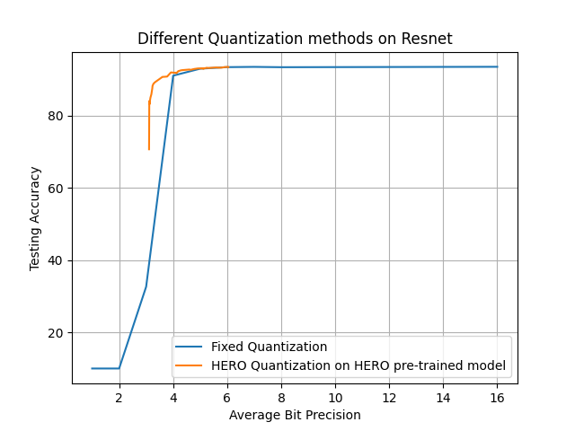
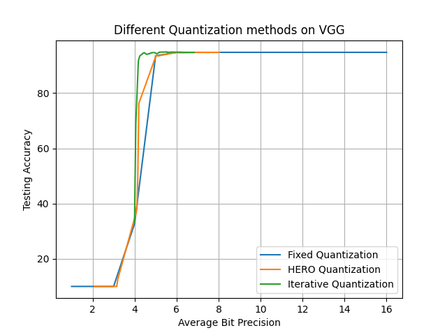

# Contents
- [About Me](#about-me)
- [Projects](#projects)
	- [AI](#ai)
		- [HERO Quantization](#hero-quantization)
		- [Iterative Quantization](#iterative-quantization)
	- [8-bit CPU](#8-bit-cpu)
- [USAPhO](#USA-Physics-competition-(usapho))

---

# About Me

A high school student passionate about pursuing a career in Electrical Engineering or Physics.
---

# Projects

---

## AI

My focus within the large field of AI is on the effecient quantization of neural networks. The two specific projects listed here are both mixed precision quantization schemes, meaning that the
different layers within the networks don't necessarily have the same quantization bit precision

---

### HERO-based Quantization
This method aims to reduce the weight perturbation-induced loss while maintaining low bit-widths.
<!-- by only giving large bit precisions to layers with a rough loss surface. -->
It uses each layer's Hessian eigenvalue to determine how the bit configuration is formed, as it represents the smoothness of the loss function.
It is especially powerful for models trained with HERO[^1] (**H**essian-**e**nhanced **R**obust **O**ptimization).
Fig.1 is an example of a 2x performance gain over fixed precision quantization.

---

### Iterative Quantization
This method is based on the intuition of gradient descent. It chooses the optimal bit configuration by learning the local optimal choice, and works for pre-trained models of all varieties
**add gif**
Iterative Quantization performs well on a variety of models, even ones that weren't trained using HERO, as shown in Fig.2.
I am preparing a paper which will be published in the IEEE International Symposium on Circuits and Systems (ISCAS).

---
<figure>

<figcaption align = "center"><b>Fig.1 HERO-based Quantization performance vs Fixed precision Quantization performance</b>
</figcaption>
</figure>
<figure>

<figcaption align = "center"><b>Fig.2 Iterative Quantization performance vs HERO-based and Fixed precision Quantization</b>
</figcaption>
</figure>

## 8-bit CPU

This project involved building a mostly-functioning CPU from scratch, using only logic circuits offered in TI's 74-series of integrated circuits. Right now each of the components are working (ALU, RAM, Registers A/B, and the Decimal Display).
I am currently working on building the control logic, the part of the computer that will read and process instructions and command each part to do the appropriate operations. So far, I have finished the Ring Counter and the Program Counter portion of this final leg of the computer.  
<!--  -->

### Videos
1. [https://youtu.be/4WzkkjmJwrw](https://youtu.be/4WzkkjmJwrw)
2. [https://youtu.be/yc6WBX6zgWk](https://youtu.be/yc6WBX6zgWk)
3. [https://youtu.be/4z909RtefZI](https://youtu.be/4z909RtefZI)

---

---

# USA Physics Olympiad (USAPhO)

---

[^1]: HERO Paper: [https://arxiv.org/abs/2111.11986](https://arxiv.org/abs/2111.11986)
